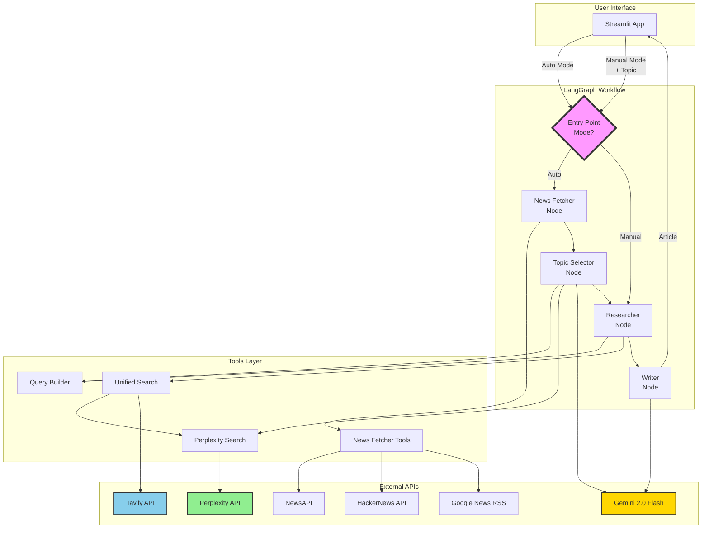
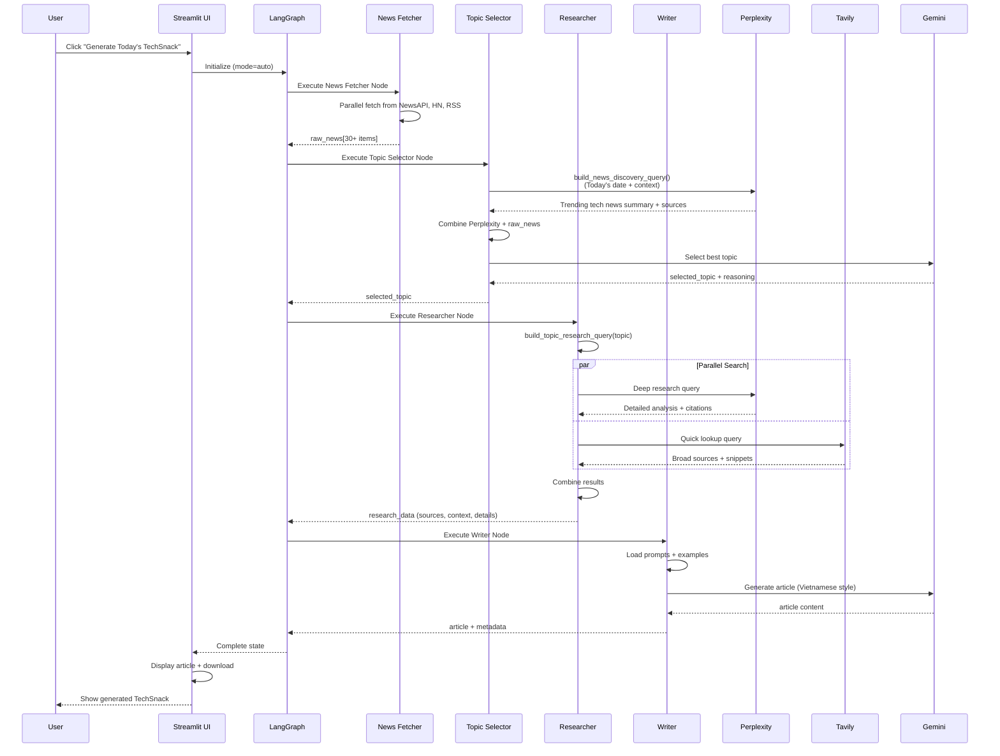
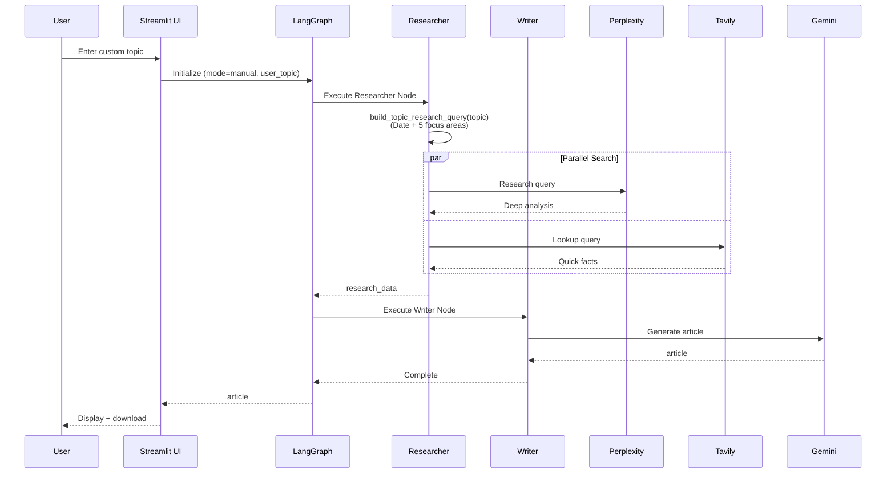
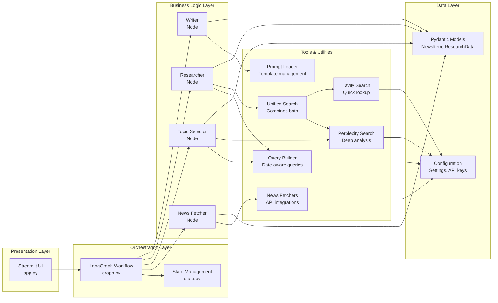
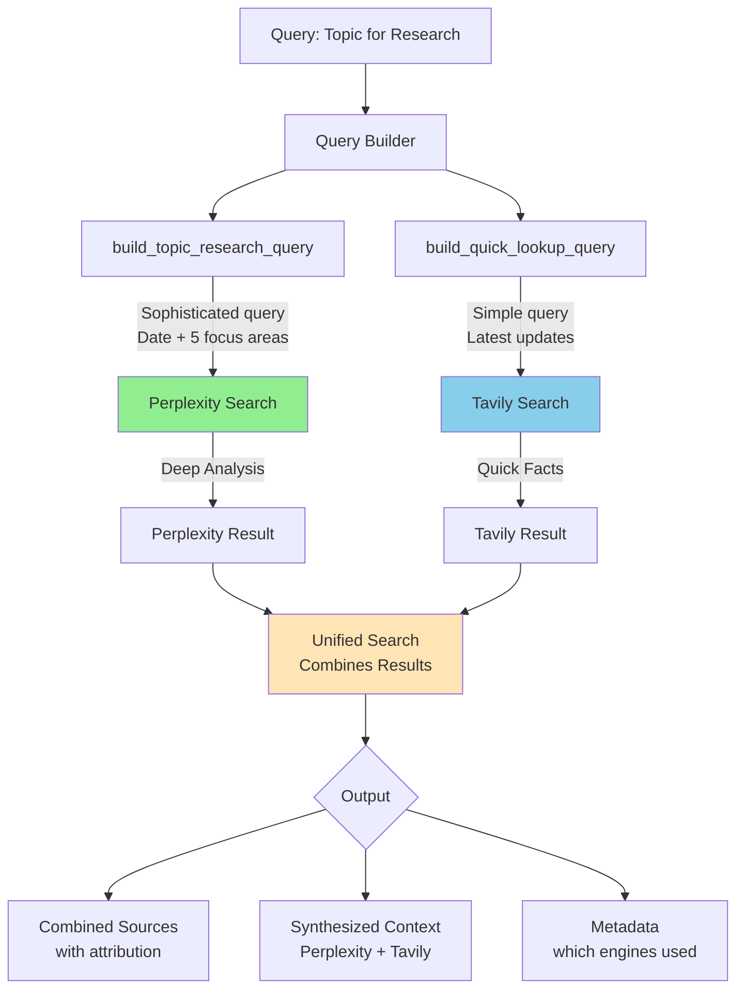
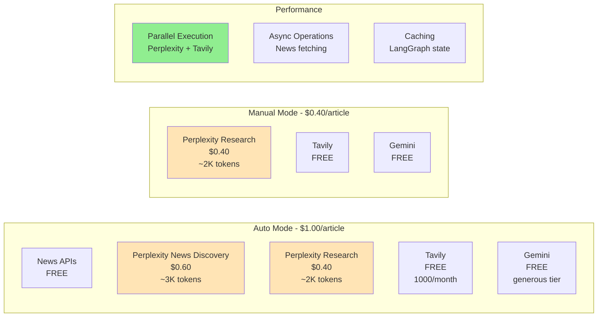

# TechSnack AI - System Architecture

## High-Level Architecture



## Detailed Workflow - Auto Mode



## Detailed Workflow - Manual Mode



## Component Architecture



## Data Flow - Unified Search



## Query Builder Strategy

```mermaid
graph TB
    subgraph "Query Types"
        Q1[News Discovery Query]
        Q2[Topic Research Query]
        Q3[Quick Lookup Query]
    end
    
    subgraph "News Discovery<br/>(Auto Mode)"
        ND1[Today: date + day]
        ND2[Focus: Big Tech, AI, Tools]
        ND3[Target: Engineers]
        ND4[Include: Layoffs, Funding]
    end
    
    subgraph "Topic Research<br/>(Both Modes)"
        TR1[What it is & Why now]
        TR2[Technical Details]
        TR3[Industry Context]
        TR4[Developer Perspective]
        TR5[Critical Analysis]
    end
    
    subgraph "Quick Lookup<br/>(Tavily)"
        QL1[Simple keywords]
        QL2[Latest updates]
        QL3[Guides & tutorials]
    end
    
    Q1 --> ND1
    Q1 --> ND2
    Q1 --> ND3
    Q1 --> ND4
    
    Q2 --> TR1
    Q2 --> TR2
    Q2 --> TR3
    Q2 --> TR4
    Q2 --> TR5
    
    Q3 --> QL1
    Q3 --> QL2
    Q3 --> QL3
    
    style Q1 fill:#FFB6C1
    style Q2 fill:#98FB98
    style Q3 fill:#87CEEB
```



## Cost & Performance Profile



## File Structure

```
techsnacks-agent/
├── app.py                          # Streamlit UI entry point
│
├── src/techsnack/
│   ├── config.py                   # Settings & API keys
│   ├── models.py                   # NewsItem
│   │
│   ├── graph/
│   │   ├── graph.py               # LangGraph workflow
│   │   ├── state.py               # TechSnackState, ResearchData
│   │   └── nodes/
│   │       ├── news_fetcher_node.py      # Parallel news fetching
│   │       ├── topic_selector_node.py    # Perplexity discovery + LLM selection
│   │       ├── researcher_node.py        # Unified search (Perplexity + Tavily)
│   │       └── writer_node.py           # Article generation
│   │
│   ├── tools/
│   │   ├── query_builder.py       # 🆕 Smart, date-aware queries
│   │   ├── perplexity_search.py   # 🆕 Perplexity integration
│   │   ├── web_search.py          # 🆕 Unified search (both engines)
│   │   └── news_fetcher.py        # NewsAPI, HN, RSS
│   │
│   └── prompts/
│       ├── prompts.py             # Prompt loader
│       ├── topic_selector.md      # Selection criteria
│       ├── writer.md              # Vietnamese style guide
│       └── examples/              # Few-shot examples
│
└── tests/
    ├── test_setup.py              # Environment verification
    ├── test_tools.py              # API integrations
    ├── test_perplexity.py         # 🆕 Perplexity tests
    └── test_graph.py              # End-to-end workflow
```

## Key Design Decisions

### 1. **Dual Search Strategy**
- **Perplexity**: Deep, contextual analysis with citations
- **Tavily**: Fast, broad coverage with diverse sources
- **Together**: Best of both worlds

### 2. **Smart Query Builder**
- Date-aware queries for relevance
- Context-rich prompts for better results
- Different strategies for discovery vs research

### 3. **Parallel Execution**
- News fetching: All 3 sources in parallel
- Search: Perplexity + Tavily simultaneously
- Reduces total latency significantly

### 4. **No Feature Flags**
- Both search engines used by default
- Simpler configuration
- Better out-of-box experience

### 5. **Type Safety**
- Pydantic models throughout
- Clear data contracts between nodes
- Easy debugging and validation

---

**Legend:**
- 🆕 = New Perplexity integration components
- FREE = No cost APIs
- $ = Paid APIs with costs shown

